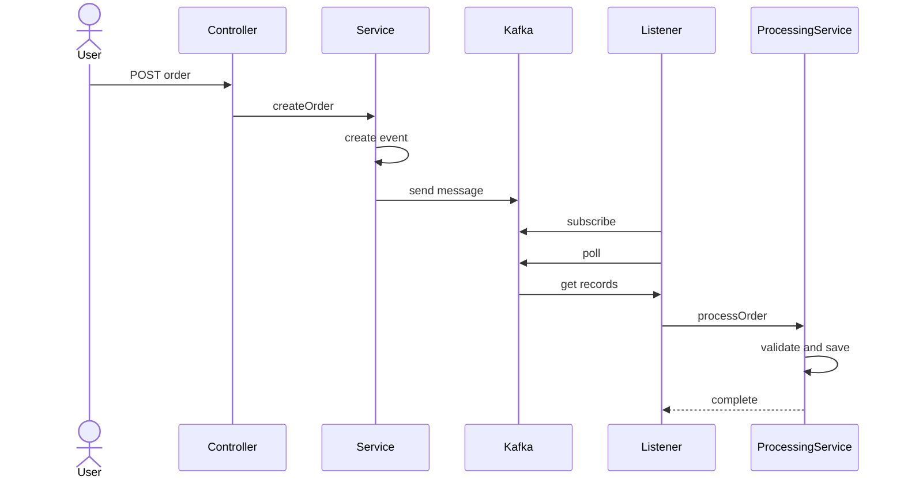

# Order Native Kafka

Native Kafka Client를 사용한 주문 이벤트 처리 시스템입니다.
Spring Kafka 대신 **Apache Kafka Client를 직접 사용**하여 Kafka의 동작 원리를 학습할 수 있습니다.

---
## 데이터 흐름



---

## 프로젝트 구조

```
order-native-kafka/
├── common/                          # 공유 모듈
│   └── src/main/java/org/example/common/
│       ├── constants/
│       │   ├── KafkaConstants.java  # Kafka 설정 상수
│       │   └── OrderTopic.java      # 토픽명 상수
│       ├── dto/
│       │   └── OrderEvent.java      # 이벤트 DTO (record)
│       └── util/
│           └── JsonUtils.java       # JSON 직렬화/역직렬화
│
├── producer/                        # Producer 모듈 (포트: 8080)
│   └── src/main/java/org/example/producer/
│       ├── config/
│       │   └── KafkaProducerConfig.java
│       ├── controller/
│       │   ├── OrderController.java
│       │   ├── request/OrderRequest.java
│       │   └── response/OrderResponse.java
│       └── service/
│           └── OrderService.java    # Kafka 발행 로직
│
└── consumer/                        # Consumer 모듈 (다중 인스턴스 가능)
    └── src/main/java/org/example/consumer/
        ├── config/
        │   └── KafkaConsumerConfig.java
        ├── listener/
        │   └── OrderEventListener.java   # 수동 폴링 리스너
        └── service/
            └── OrderProcessingService.java
```

---

## Native Kafka vs Spring Kafka

| 구분 | Native Kafka (이 프로젝트) | Spring Kafka |
|------|---------------------------|--------------|
| 의존성 | `kafka-clients` | `spring-kafka` |
| Producer | `KafkaProducer.send()` | `KafkaTemplate.send()` |
| Consumer | `while` + `poll()` 수동 루프 | `@KafkaListener` 어노테이션 |
| 설정 | `Properties` 직접 설정 | `application.yml` 자동 바인딩 |
| 학습 | Kafka 원리 이해에 적합 | 실무 생산성에 적합 |

---

## Kafka 핵심 개념

### 토픽 (Topic)
메시지가 저장되는 카테고리. 이 프로젝트에서는 `order-created` 토픽 사용.

### 파티션 (Partition)
토픽을 나눈 단위. 같은 키를 가진 메시지는 같은 파티션으로 전송되어 **순서 보장**.

### 오프셋 (Offset)
파티션 내 메시지의 순서 번호. Consumer는 오프셋으로 어디까지 읽었는지 추적.

### Consumer Group
같은 그룹의 Consumer들은 파티션을 나눠서 처리 (로드밸런싱).

---

## 기술 스택

- Java 21
- Spring Boot 3.5.9
- Apache Kafka Client (Native)
- Gradle (Multi-module)
- Lombok
- Jackson (JSON)

---

## 📚 학습 가이드 - 문서 읽는 순서

이 프로젝트는 **Kafka를 low-level부터 체계적으로 이해**하기 위해 설계되었습니다.

### 추천 학습 경로

```
1️⃣ README.md (현재 페이지)
   └─ 프로젝트 소개 및 기술 스택 이해

2️⃣ docs/00-overview/README.md
   └─ 전체 학습 로드맵 파악 (5 Phase 구조)
   └─ 각 Phase의 목표 및 학습 체크리스트

3️⃣ docs/01-fundamentals/ (필수)
   ├─ topic-partition.md    # 토픽과 파티션 개념
   ├─ producer-consumer.md  # Producer/Consumer 기초
   └─ cli-commands.md       # Kafka CLI 명령어 (실습 필수)

4️⃣ docs/LEARNING_PLAN.md (실습)
   ├─ Part 1: Producer 심화 (8 Stages)
   ├─ Part 2: Consumer 직접 구현 (3 Stages)
   └─ 각 Stage: 개념 → 퀴즈 → 구현 → 검증

5️⃣ docs/02-producer/ (구현 중)
   └─ Producer 관련 상세 문서

6️⃣ docs/03-consumer/ (구현 중)
   └─ Consumer 관련 상세 문서

7️⃣ docs/04-real-world/ (선택)
   └─ 실전 프로젝트 (File Monitoring, DB Writer)

8️⃣ docs/05-cluster/ (선택)
   └─ 클러스터 운영 및 장애 복구

9️⃣ docs/06-advanced/ (선택)
   └─ Schema Registry, 보안, 모니터링

❓ docs/KAFKA_COMMANDS.md
   └─ 자주 사용하는 Kafka CLI 명령어 모음

📝 docs/MY_LEARNING_NOTES.md
   └─ 학습 과정에서 정리한 개인 노트

✅ docs/QUIZ_ANSWERS.md
   └─ LEARNING_PLAN.md의 퀴즈 정답
```

### 각 단계별 예상 시간

| 단계 | 주제 | 예상 시간 | 난이도 |
|------|------|---------|--------|
| 1 | 기초 개념 학습 | 1-2시간 | ⭐ |
| 2 | 로드맵 파악 | 30분 | ⭐ |
| 3 | Fundamentals 학습 | 2-3시간 | ⭐⭐ |
| 4 | Producer 심화 (Stages 1-8) | 3-4시간 | ⭐⭐⭐ |
| 5 | Consumer 심화 (Stages 9-11) | 2-3시간 | ⭐⭐⭐ |
| 6-9 | 심화 주제 (선택) | 4-6시간 | ⭐⭐⭐⭐ |

### 학습 방식

각 Stage마다 다음 패턴으로 진행됩니다:

1. **📖 개념 설명** - 이론 학습
2. **🤔 예상 퀴즈** - 코드 작성 전 동작 예측
3. **💻 구현** - 직접 코드 작성
4. **✅ 결과 확인** - kafka-console-consumer로 검증
5. **💡 핵심 포인트** - 배운 내용 정리
