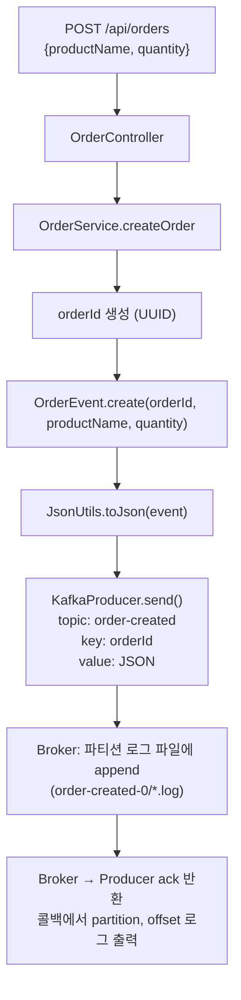
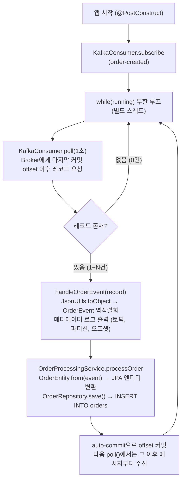

# Order Native Kafka

Native Kafka Client를 사용한 주문 이벤트 처리 시스템입니다.
Spring Kafka 대신 **Apache Kafka Client를 직접 사용**하여 Producer/Consumer를 구현하고, 수신한 주문 이벤트를 **PostgreSQL에 저장**합니다.

---

## 기술 스택

- Java 21
- Spring Boot 3.5.9
- Apache Kafka Client (Native)
- PostgreSQL 17 + Spring Data JPA
- Gradle (Multi-module)
- Lombok / Jackson

---

## 프로젝트 구조

```
order-native-kafka/
├── common/                              # 공유 모듈
│   └── src/main/java/org/example/common/
│       ├── constants/
│       │   ├── KafkaConstants.java      # Kafka 설정 상수
│       │   └── OrderTopic.java          # 토픽명 상수
│       ├── dto/
│       │   └── OrderEvent.java          # 이벤트 DTO (record)
│       └── util/
│           ├── DateUtils.java           # 날짜 포맷 유틸
│           └── JsonUtils.java           # JSON 직렬화/역직렬화
│
├── producer/                            # Producer 모듈 (포트: 9000)
│   └── src/main/java/org/example/producer/
│       ├── config/
│       │   └── KafkaProducerConfig.java
│       ├── controller/
│       │   ├── OrderController.java
│       │   └── request/OrderRequest.java
│       │   └── response/OrderResponse.java
│       ├── service/
│       │   └── OrderService.java        # Kafka 발행 로직
│       ├── AppleOrderMessage.java       # 테스트용 메시지 생성기
│       ├── PlayGround.java              # apple-order-topic 연속 발송 (standalone)
│       └── OrderPlayGround.java         # order-created 연속 발송 (standalone)
│
├── consumer/                            # Consumer 모듈
│   └── src/main/java/org/example/consumer/
│       ├── config/
│       │   └── KafkaConsumerConfig.java
│       ├── entity/
│       │   └── OrderEntity.java         # JPA 엔티티
│       ├── repository/
│       │   └── OrderRepository.java     # Spring Data JPA
│       ├── listener/
│       │   └── OrderEventListener.java  # 수동 폴링 리스너
│       ├── service/
│       │   └── OrderProcessingService.java  # DB 저장 로직
│       └── SimpleConsumer.java          # standalone Consumer 예제
│
└── docker/
    └── docker-compose.yml               # PostgreSQL
```

---

## Producer 모듈 (`:9000`)

REST API로 주문을 받아 Kafka 토픽에 메시지를 발행합니다.



## Consumer 모듈

Kafka 토픽을 폴링하여 메시지를 수신하고 PostgreSQL에 저장합니다.



---

## 실행 방법

### 1. 인프라 기동

```bash
# PostgreSQL 실행
docker compose -f docker/docker-compose.yml up -d

# Kafka 실행 (로컬 설치 기준)
kafka-server-start.sh ~/desktop/kafka/config/kraft/reconfig/server.properties
```

### 2. Consumer 실행

```bash
./gradlew :consumer:bootRun
```

### 3. 메시지 발송

**API로 단건 발송:**
```bash
curl -X POST http://localhost:9000/api/orders \
  -H "Content-Type: application/json" \
  -d '{"productName":"MacBook Pro","quantity":1}'
```

**OrderPlayGround로 연속 발송 (IDE에서 main 실행):**
```
OrderPlayGround.main()
→ order-created 토픽으로 1초 간격 무한 발송
→ Consumer가 수신하여 PostgreSQL에 저장
```

---

## Kafka 메시지 확인 방법

### kafka-console-consumer (토픽 메시지 소비)

```bash
# 처음부터 전체 메시지 확인
kafka-console-consumer.sh --bootstrap-server localhost:9092 \
  --topic order-created --from-beginning

# 지금부터 들어오는 메시지만 실시간 확인
kafka-console-consumer.sh --bootstrap-server localhost:9092 \
  --topic order-created
```

### kafka-dump-log (로그 세그먼트 파일 직접 덤프)

Kafka는 메시지를 파티션별 로그 파일에 바이너리로 저장합니다. `kafka-dump-log`로 내용을 확인할 수 있습니다.

```bash
# 로그 파일 위치 확인
ls ~/desktop/kafka/kafka-logs/order-created-0/

# 로그 덤프 (메시지 내용 포함)
kafka-dump-log.sh \
  --files ~/desktop/kafka/kafka-logs/order-created-0/00000000000000000000.log \
  --print-data-log
```

**로그 디렉토리 구조:**
```
kafka-logs/order-created-0/
├── 00000000000000000000.log         # 실제 메시지 데이터 (바이너리)
├── 00000000000000000000.index       # 오프셋 → 파일 위치 매핑
├── 00000000000000000000.timeindex   # 타임스탬프 → 오프셋 매핑
├── leader-epoch-checkpoint          # 리더 에포크 정보
└── partition.metadata               # 파티션 메타데이터
```

---

## Native Kafka vs Spring Kafka

| 구분 | Native Kafka (이 프로젝트) | Spring Kafka |
|------|---------------------------|--------------|
| 의존성 | `kafka-clients` | `spring-kafka` |
| Producer | `KafkaProducer.send()` | `KafkaTemplate.send()` |
| Consumer | `while` + `poll()` 수동 루프 | `@KafkaListener` 어노테이션 |
| 설정 | `Properties` 직접 설정 | `application.yml` 자동 바인딩 |
