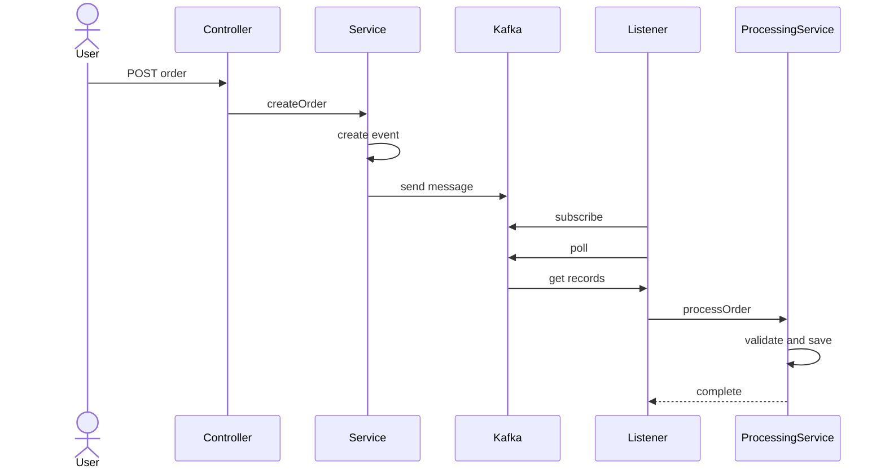

# Order Native Kafka

Native Kafka Client를 사용한 주문 이벤트 처리 시스템입니다.
Spring Kafka 대신 **Apache Kafka Client를 직접 사용**하여 Kafka의 동작 원리를 학습할 수 있습니다.

---
## 데이터 흐름



---

## 프로젝트 구조

```
order-native-kafka/
├── common/                          # 공유 모듈
│   └── src/main/java/org/example/common/
│       ├── constants/
│       │   ├── KafkaConstants.java  # Kafka 설정 상수
│       │   └── OrderTopic.java      # 토픽명 상수
│       ├── dto/
│       │   └── OrderEvent.java      # 이벤트 DTO (record)
│       └── util/
│           └── JsonUtils.java       # JSON 직렬화/역직렬화
│
├── producer/                        # Producer 모듈 (포트: 8080)
│   └── src/main/java/org/example/producer/
│       ├── config/
│       │   └── KafkaProducerConfig.java
│       ├── controller/
│       │   ├── OrderController.java
│       │   ├── request/OrderRequest.java
│       │   └── response/OrderResponse.java
│       └── service/
│           └── OrderService.java    # Kafka 발행 로직
│
└── consumer/                        # Consumer 모듈 (다중 인스턴스 가능)
    └── src/main/java/org/example/consumer/
        ├── config/
        │   └── KafkaConsumerConfig.java
        ├── listener/
        │   └── OrderEventListener.java   # 수동 폴링 리스너
        └── service/
            └── OrderProcessingService.java
```

---

## Native Kafka vs Spring Kafka

| 구분 | Native Kafka (이 프로젝트) | Spring Kafka |
|------|---------------------------|--------------|
| 의존성 | `kafka-clients` | `spring-kafka` |
| Producer | `KafkaProducer.send()` | `KafkaTemplate.send()` |
| Consumer | `while` + `poll()` 수동 루프 | `@KafkaListener` 어노테이션 |
| 설정 | `Properties` 직접 설정 | `application.yml` 자동 바인딩 |
| 학습 | Kafka 원리 이해에 적합 | 실무 생산성에 적합 |

---

## Kafka 핵심 개념

### 토픽 (Topic)
메시지가 저장되는 카테고리. 이 프로젝트에서는 `order-created` 토픽 사용.

### 파티션 (Partition)
토픽을 나눈 단위. 같은 키를 가진 메시지는 같은 파티션으로 전송되어 **순서 보장**.

### 오프셋 (Offset)
파티션 내 메시지의 순서 번호. Consumer는 오프셋으로 어디까지 읽었는지 추적.

### Consumer Group
같은 그룹의 Consumer들은 파티션을 나눠서 처리 (로드밸런싱).

---

## 기술 스택

- Java 21
- Spring Boot 3.5.9
- Apache Kafka Client (Native)
- Gradle (Multi-module)
- Lombok
- Jackson (JSON)
