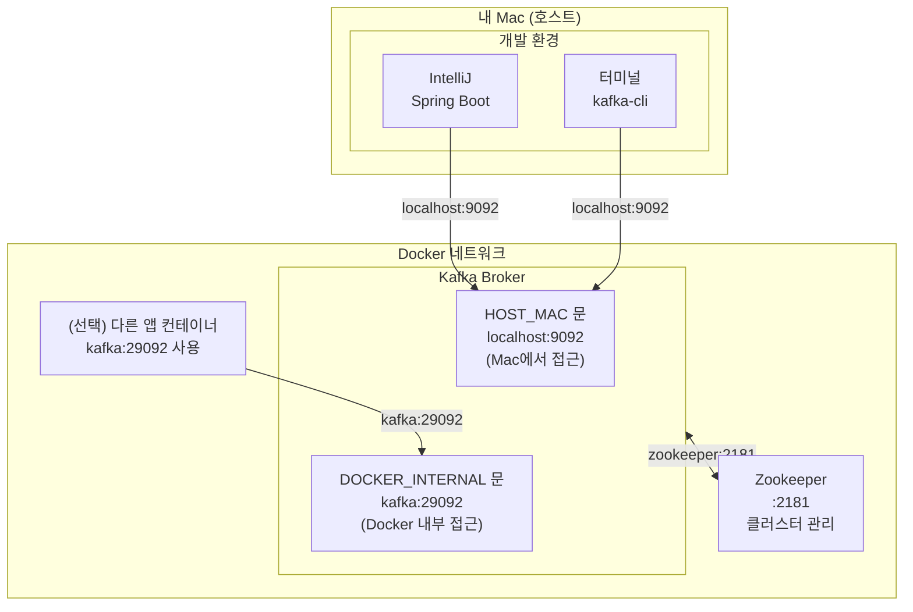
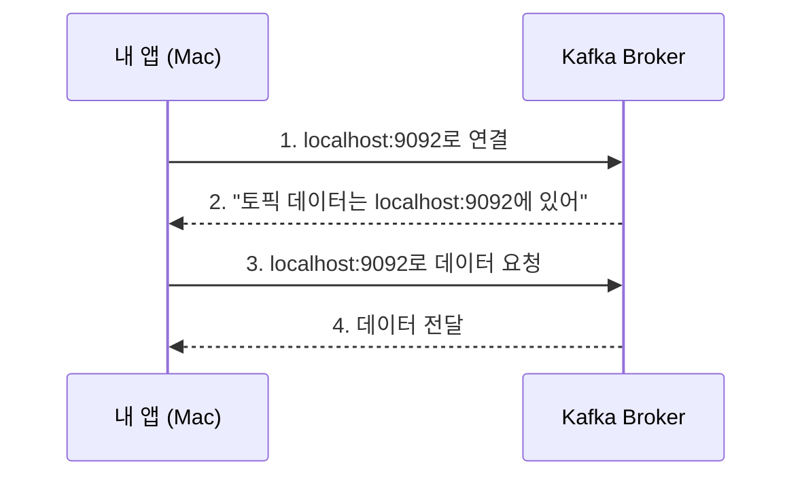

# Kafka Docker Compose 구조도

## 전체 구조



## 연결 흐름



## 포트 매핑

| 호스트 (Mac) | Docker 내부 | 용도 |
|-------------|-------------|------|
| localhost:9092 | kafka:9092 | Mac에서 Kafka 접근 |
| localhost:29092 | kafka:29092 | (보통 사용 안 함) |
| localhost:2181 | zookeeper:2181 | Zookeeper 직접 접근 |

## 리스너 설정

```yaml
# 문(리스너) 이름 -> 보안 프로토콜
KAFKA_LISTENER_SECURITY_PROTOCOL_MAP: DOCKER_INTERNAL:PLAINTEXT,HOST_MAC:PLAINTEXT

# 각 문의 주소
KAFKA_ADVERTISED_LISTENERS: DOCKER_INTERNAL://kafka:29092,HOST_MAC://localhost:9092

# 브로커 간 통신용 문
KAFKA_INTER_BROKER_LISTENER_NAME: DOCKER_INTERNAL
```

| 문 이름 | 주소 | 누가 사용? |
|--------|------|-----------|
| DOCKER_INTERNAL | kafka:29092 | Docker 내부 컨테이너 |
| HOST_MAC | localhost:9092 | 내 Mac |
| PLAINTEXT | - | 암호화 없음 (개발용) |

## 연결 방법

### Mac에서 Spring Boot 앱 실행 시

```properties
spring.kafka.bootstrap-servers=localhost:9092
```

### Docker 내부 다른 컨테이너에서 연결 시

```yaml
environment:
  SPRING_KAFKA_BOOTSTRAP_SERVERS: kafka:29092
```

### 터미널에서 테스트

```bash
# 토픽 생성
docker exec kafka kafka-topics --create \
  --topic test-topic \
  --bootstrap-server kafka:29092 \
  --partitions 1 \
  --replication-factor 1

# 메시지 전송
docker exec -it kafka kafka-console-producer \
  --topic test-topic \
  --bootstrap-server kafka:29092

# 메시지 수신
docker exec -it kafka kafka-console-consumer \
  --topic test-topic \
  --bootstrap-server kafka:29092 \
  --from-beginning
```

## 시작/종료 명령어

```bash
# 시작
docker compose up -d

# 상태 확인
docker compose ps

# 로그 확인
docker compose logs -f kafka

# 종료
docker compose down

# 종료 + 데이터 삭제
docker compose down -v
```

## 버전 정보

| 컴포넌트 | 이미지 | 기반 Kafka |
|----------|--------|-----------|
| Zookeeper | cp-zookeeper:7.9.0 | 3.9 |
| Kafka | cp-kafka:7.9.0 | 3.9 |
| 클라이언트 | kafka-clients | 3.9.x ~ 4.x |
