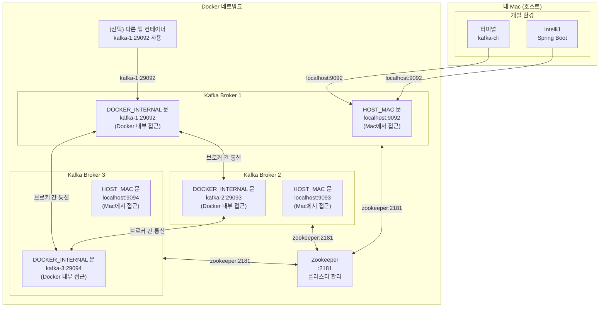
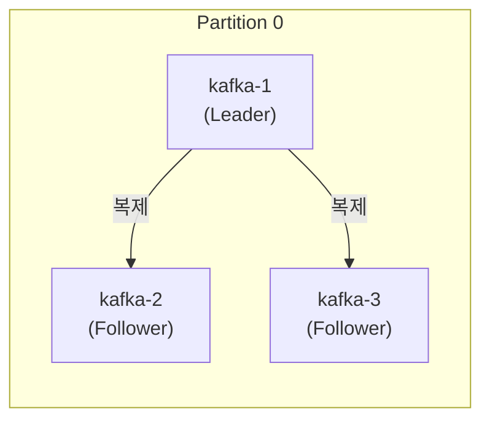
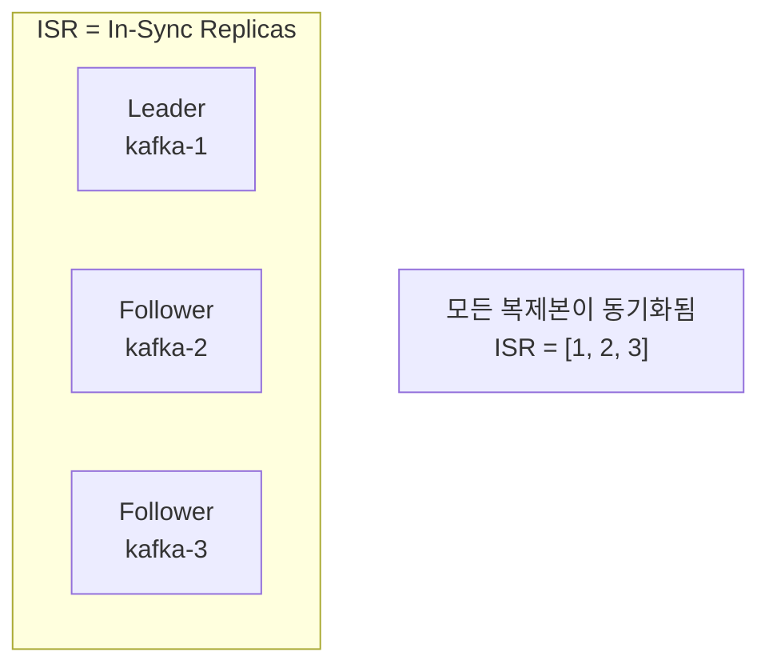
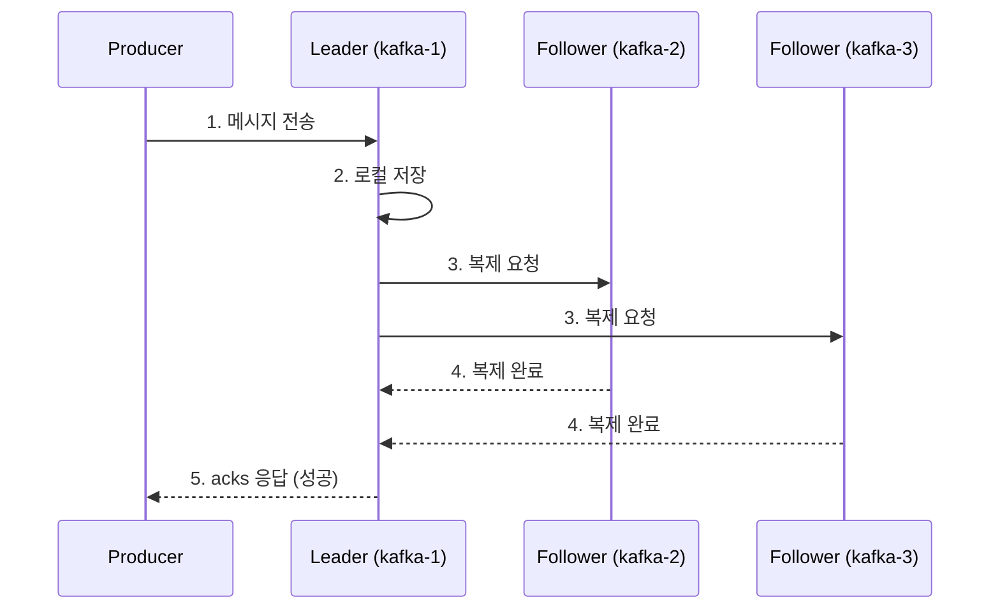
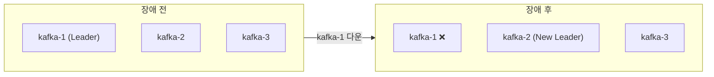

# Kafka Docker Compose 상세 구조도 (멀티 브로커)

> 단일 브로커 구조는 [ARCHITECTURE.md](./ARCHITECTURE.md) 참고

---

## 전체 구조 (3대 브로커)



---

## 포트 매핑

| 브로커 | 호스트 (Mac) | Docker 내부 | BROKER_ID |
|--------|-------------|-------------|-----------|
| kafka-1 | localhost:9092 | kafka-1:29092 | 1 |
| kafka-2 | localhost:9093 | kafka-2:29093 | 2 |
| kafka-3 | localhost:9094 | kafka-3:29094 | 3 |

---

## 리스너 설정 (kafka-1 예시)

```yaml
# 문(리스너) 이름 -> 보안 프로토콜
KAFKA_LISTENER_SECURITY_PROTOCOL_MAP: DOCKER_INTERNAL:PLAINTEXT,HOST_MAC:PLAINTEXT

# 각 문의 주소
KAFKA_ADVERTISED_LISTENERS: DOCKER_INTERNAL://kafka-1:29092,HOST_MAC://localhost:9092

# 브로커 간 통신용 문
KAFKA_INTER_BROKER_LISTENER_NAME: DOCKER_INTERNAL
```

| 문 이름 | 주소 | 누가 사용? |
|--------|------|-----------|
| DOCKER_INTERNAL | kafka-X:2909X | Docker 내부 컨테이너, 브로커 간 통신 |
| HOST_MAC | localhost:909X | 내 Mac |
| PLAINTEXT | - | 암호화 없음 (개발용) |

---

## 단일 vs 멀티 브로커 비교

| 구분 | 단일 브로커 | 멀티 브로커 (3대) |
|------|-----------|-----------------|
| 복제 (Replication) | ❌ 불가능 | ✅ 가능 |
| 장애 대응 | ❌ 불가능 | ✅ 자동 Leader 선출 |
| acks=all 효과 | acks=1과 동일 | ISR 전체 복제 보장 |
| 용도 | 개발/학습 | 개발/운영 |

---

## 복제(Replication) 구조



### ISR (In-Sync Replicas)



| acks 설정 | 동작 | 응답 시점 |
|-----------|------|----------|
| `0` | 확인 안 함 | 즉시 |
| `1` | Leader만 저장 | Leader 저장 후 |
| `all` (`-1`) | **ISR 전체** 저장 | 모든 ISR 복제 완료 후 |

---

## 메시지 흐름 (acks=all)



---

## 장애 시나리오

### kafka-1이 다운되면?



- Zookeeper가 감지 → 새 Leader 선출
- ISR 중 하나가 Leader로 승격
- 클라이언트는 자동으로 새 Leader에 연결

---

## 연결 방법

### Mac에서 Spring Boot 앱 실행 시

```properties
spring.kafka.bootstrap-servers=localhost:9092
```

> **Bootstrap Server**: 하나만 지정해도 클러스터 전체 메타데이터를 받아옴

### Docker 내부 다른 컨테이너에서 연결 시

```yaml
environment:
  SPRING_KAFKA_BOOTSTRAP_SERVERS: kafka-1:29092,kafka-2:29093,kafka-3:29094
```
