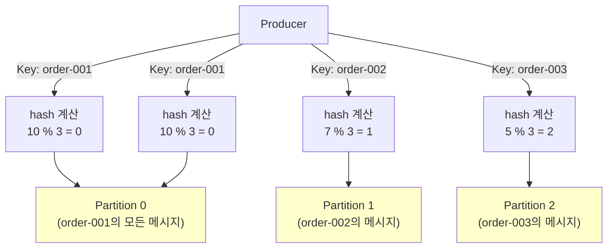

# Stage 1: 파티션 3개 + 키 기반 라우팅

## 파티션 전략 (키가 null일 때)

| Kafka 버전   | 전략                     | 동작                          |
|------------|------------------------|-----------------------------|
| **2.3 이하** | Round Robin            | 메시지마다 파티션 변경 (0→1→2→0→1...) |
| **2.4 이상** | **Sticky Partitioner** | 같은 배치 내에선 같은 파티션 유지         |

**Sticky Partitioner가 도입된 이유:**

- 라운드 로빈은 메시지마다 파티션이 바뀜 → 배치 데이터를 빨리 채우지 못하면서 전송이 늦어지거나 배치를 다 채우지 못하고 전송 하면서 전송 성능이 떨어지는 문제 발생
- Sticky는 `linger.ms` 동안 같은 파티션에 모아서 배치 전송 → 처리량 향상

**예시**

```
Round Robin: msg1→P0, msg2→P1, msg3→P2, msg4→P0 (순환)
Sticky:      msg1→P0, msg2→P0, msg3→P0 (배치) → msg4→P1 (새 배치)
```

**Sticky Partitioner 동작 흐름 (batch.size = 16KB):**

```
Sticky Partitioner의 동작 흐름:

┌─ Partition 0 (Sticky) ──────────────────────────┐
│  Message 1 (25 bytes)                           │
│  Message 2 (25 bytes)                           │
│  ... 계속 같은 파티션...                         │
│  Message 654 (25 bytes)                         │
│  총 누적 크기: ~16,350 bytes → 배치 초과!      │
└─────────────────────────────────────────────────┘
            ↓ 배치 플러시 (Flush)

┌─ Partition 1 (새로운 Sticky) ─────────────────┐
│  Message 655 (25 bytes)                        │
│  Message 656 (25 bytes)                        │
│  ... 계속 같은 파티션...                        │
│  Message 1308 (25 bytes)                       │
│  총 누적 크기: ~16,350 bytes → 배치 초과!     │
└────────────────────────────────────────────────┘
            ↓ 배치 플러시

┌─ Partition 2 (새로운 Sticky) ──────────────────┐
│  Message 1309 (25 bytes)                       │
│  ... 반복                                      │
```

**핵심 설정:**

| 설정             | 기본값          | 역할                             |
|----------------|--------------|--------------------------------|
| **batch.size** | 16,384 bytes | ⚡ 배치 크기 한계 (도달하면 플러시)          |
| **linger.ms**  | 0ms          | ⏰ 배치를 기다리는 최대 시간 (0 = 기다리지 않음) |

**플러시 조건:**

1. `batch.size` 도달 (16,384 bytes) → **즉시 플러시** 🔥
2. `linger.ms` 시간 경과 (기본 0ms = 사용 안 함)
3. `producer.flush()` 명시적 호출
4. `producer.close()` 또는 JVM 종료

---

## 파티션 전략 (키가 있을 때)

**핵심 개념:** 같은 키는 항상 같은 파티션으로 전송됨 (메시지 순서 보장)

| 전략                   | 동작                                  | 사용 목적                       |
|----------------------|-------------------------------------|-----------------------------|
| **Hash Partitioner** | hash(key) % partition_count로 파티션 결정 | 같은 key는 항상 같은 파티션으로 (순서 보장) |

**왜 필요한가?**

- 같은 주문(order_id)의 모든 이벤트를 같은 파티션에 모으면 → 순서 보장 가능
- key가 없으면 순서를 보장할 수 없음 (스케일링 문제)

**예시:**



**코드 예시:**

```java
// 같은 key는 항상 같은 파티션으로 전송
producer.send(
    new ProducerRecord<>("topic", "order-001","메시지1")  // Partition 0
);
producer.send(
    new ProducerRecord<>("topic", "order-001","메시지2")  // Partition 0 (같음!)
);
```
