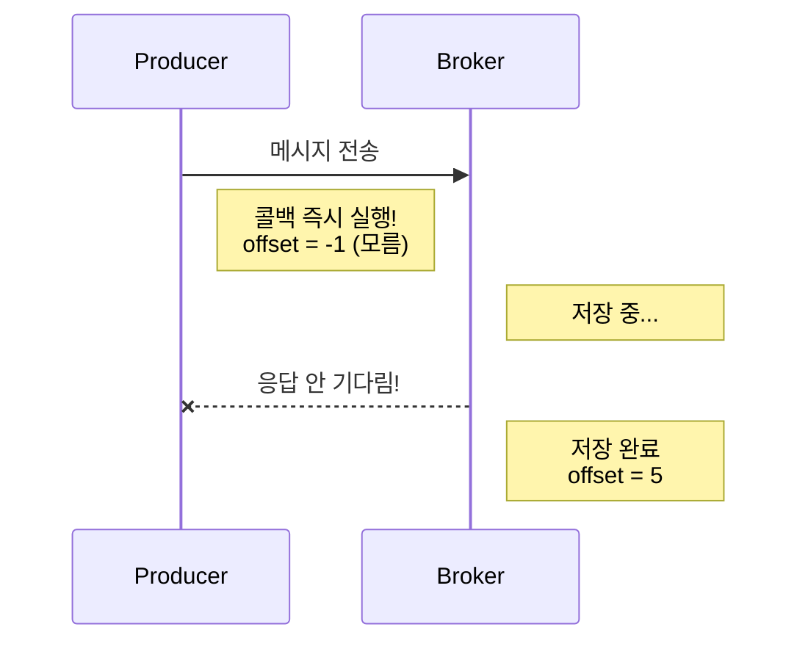

# Stage 2: acks 설정과 전송 보장

## Kafka 클러스터 구조와 Leader Partition 할당

### Leader Partition이 정해지는 방식

**요약:** Kafka가 토픽 생성 시 **자동으로 Round-Robin 알고리즘으로 할당**

**토픽 생성 명령어:**

```bash
kafka-topics --create --topic acks-topic \
  --partitions 3 \
  --replication-factor 3 \
  -- min.insync.replicas=2 \
  --bootstrap-server localhost:9092
```

### Round-Robin 알고리즘 (자동 할당)

**Step 1: 브로커 목록 가져오기**

```
Available Brokers: [1, 2, 3]
```

**Step 2: 각 Partition의 Replica List 생성 (Round-Robin)**

```
Partition 0: [Broker 1, Broker 2, Broker 3]  ← 첫 번째 = Leader
Partition 1: [Broker 2, Broker 3, Broker 1]  ← 첫 번째 = Leader
Partition 2: [Broker 3, Broker 1, Broker 2]  ← 첫 번째 = Leader
```

**Step 3: 결과**

```
Partition 0 Leader: Broker 1 ⭐
Partition 1 Leader: Broker 2 ⭐
Partition 2 Leader: Broker 3 ⭐
```

### 구조도

```
Kafka 클러스터 (3개 브로커)

┌──────────────────────────────────────────────────────────────┐
│                                                                │
│  Broker 1              Broker 2              Broker 3          │
│  ┌─────────────────┐  ┌─────────────────┐  ┌─────────────────┐
│  │ Partition 0     │  │ Partition 0     │  │ Partition 0     │
│  │ ⭐ Leader      │  │ 🔄 Follower     │  │ 🔄 Follower     │
│  │ (읽기/쓰기)    │  │ (복제만 함)     │  │ (복제만 함)     │
│  ├─────────────────┤  ├─────────────────┤  ├─────────────────┤
│  │ Partition 1     │  │ Partition 1     │  │ Partition 1     │
│  │ 🔄 Follower     │  │ ⭐ Leader      │  │ 🔄 Follower     │
│  │ (복제만 함)     │  │ (읽기/쓰기)    │  │ (복제만 함)     │
│  ├─────────────────┤  ├─────────────────┤  ├─────────────────┤
│  │ Partition 2     │  │ Partition 2     │  │ Partition 2     │
│  │ 🔄 Follower     │  │ 🔄 Follower     │  │ ⭐ Leader      │
│  │ (복제만 함)     │  │ (복제만 함)     │  │ (읽기/쓰기)    │
│  └─────────────────┘  └─────────────────┘  └─────────────────┘
│                                                                │
└──────────────────────────────────────────────────────────────┘

특징:
- 각 Broker가 정확히 1개의 Leader를 담당
- 부하가 균등하게 분산됨 (Load Balancing)
- 모든 쓰기/읽기는 Leader를 통해 처리
- Follower는 Leader로부터 복제만 수행
```

### Leader vs Follower

| 개념              | 설명                             | 역할                   |
|-----------------|--------------------------------|----------------------|
| **Leader** ⭐    | Partition의 주 복사본               | 모든 읽기/쓰기 처리          |
| **Follower** 🔄 | Partition의 백업 복사본              | Leader를 복제만 수행       |
| **ISR**         | In-Sync Replicas (동기화된 모든 복사본) | Leader + 모든 Follower |

### Producer 입장에서의 동작

```
1. Producer가 메시지 전송 (acks=all)
   ↓
2. Kafka가 메시지를 어느 Partition으로 보낼지 결정
   (키가 있으면: hash(key) % partition_count)
   (키가 없으면: Sticky Partitioner)
   ↓
3. 해당 Partition의 Leader Broker에 전송
   Partition 0 → Broker 1 (Leader)
   Partition 1 → Broker 2 (Leader)
   Partition 2 → Broker 3 (Leader)
   ↓
4. Leader가 메시지 저장 후 Follower에 복제 시작
   ↓
5. min.insync.replicas 확인
   - Broker 1 (Leader): 저장됨 ✓
   - Broker 2 (Follower): 저장됨 ✓
   → "안전하다!" (기본값: 2)
   ↓
6. Producer에게 응답: "성공! offset=0, partition=0"
```

### Consumer 입장에서의 동작

```
Consumer: "acks-topic의 메시지를 달라"
   ↓
Kafka가 모든 Partition의 Leader에서 메시지 읽음:
   - Partition 0 Leader: Broker 1
   - Partition 1 Leader: Broker 2
   - Partition 2 Leader: Broker 3
   ↓
메시지들을 순서대로 Consumer에게 전달
   ↓
Consumer: Message 0, 1, 2, 3, 4, ... (모든 메시지)
```

### 왜 Round-Robin으로 할당할까?

**문제 상황:**

```
만약 모든 Partition 0이 Broker 1에만 있다면?
→ Broker 1에 모든 읽기/쓰기 부하 집중 ❌
→ Broker 2, 3은 놀고 있음 (리소스 낭비)
```

**Round-Robin 해결책:**

```
각 Broker가 균등하게 Leader 담당
→ 부하 분산 ✓
→ 전체 클러스터 활용도 증가 ✓
→ 높은 처리량 달성 ✓
```

### Leader 장애 시 동작

```
Case 1: Broker 1 (Partition 0의 Leader) 다운 ⚠️
   ↓
Zookeeper가 감지
   ↓
Partition 0의 Follower 중 하나를 새 Leader로 승격
   (예: Broker 2가 새로운 Leader)
   ↓
메시지 손실 없음! (복제되어 있으니까)
   ↓
Consumer/Producer 자동으로 새 Leader로 연결
```

---

## acks 설정별 동작 차이

### 1. acks=0일 때 offset이 -1인 이유

**내 예상:** 브로커가 정상 작동 중이니까 offset이 나올 거라 기대함

**실제 결과:** offset = -1

**이유:**

- acks=0은 **응답을 기다리지 않음** (Fire and Forget)
- 브로커가 정상이어도, "저장했어?" 라고 **물어보지 않으니** 답을 모름
- offset=-1은 "저장 안 됨"이 아니라 **"확인 안 함"**의 의미!



---

## ⚠️ 주의: Kafka 3.0에서 기본값이 변경됨!

### 변경 내역

**Kafka 3.0 이전:**
- **기본값: `acks=1`**
- Leader Partition에만 저장 확인
- 성능과 안정성의 균형을 맞춘 기본값

**Kafka 3.0 이후:**
- **기본값: `acks=-1` (또는 `acks=all`)**
- 모든 In-Sync Replicas(ISR)에 저장 확인
- 데이터 안정성을 우선시하는 기본값으로 변경

### 변경 이유

Kafka 개발팀의 판단:
- 프로덕션 환경에서 **데이터 손실 방지**가 성능보다 중요
- 명시적으로 설정하지 않는 사용자도 안전한 기본값을 적용해야 함
- 개발자가 설정을 명시하지 않으면 더 보수적인 선택 필요

### 업그레이드 시 주의사항

#### 🚨 영향을 받을 코드

```java
// Kafka 3.0 이전: 암묵적으로 acks=1 적용
Properties props = new Properties();
props.put(ProducerConfig.BOOTSTRAP_SERVERS_CONFIG, "localhost:9092");
// acks 설정하지 않음 → 자동으로 acks=1 적용
KafkaProducer<String, String> producer = new KafkaProducer<>(props);
```

**Kafka 3.0으로 업그레이드하면:**
- 같은 코드도 이제 `acks=-1` (all)로 동작
- **성능이 저하될 수 있음** (모든 ISR에 확인 필요)
- **지연시간이 증가할 수 있음**

#### ✅ 권장 해결책

**Case 1: 안정성이 중요한 경우 (권장)**
```java
// 변경 불필요! 3.0 이후 기본값이 이미 안전함
// 코드 그대로 유지
```

**Case 2: 성능이 중요한 경우**
```java
// 명시적으로 acks=1 설정하여 기존 동작 유지
props.put(ProducerConfig.ACKS_CONFIG, "1");
```

**Case 3: 최대 성능이 필요한 경우**
```java
// 명시적으로 acks=0 설정 (데이터 손실 가능)
props.put(ProducerConfig.ACKS_CONFIG, "0");
```

### 버전별 기본값 정리

| Kafka 버전  | 기본값 | 특징 |
|-----------|------|------|
| < 3.0    | `acks=1` | 성능 우선 |
| ≥ 3.0    | `acks=-1` (all) | 안정성 우선 |
| (현재 권장) | 명시적 설정 | 요구사항에 맞게 설정 |

---

## min.insync.replicas와 acks의 관계

### min.insync.replicas의 역할

`min.insync.replicas`는 **acks=all일 때만 의미가 있습니다.**

#### acks 값별 min.insync.replicas 적용 여부

| acks 값 | min.insync.replicas 적용 | 설명 |
|--------|----------------------|------|
| **acks=0** | ❌ 무시됨 | 응답을 기다리지 않으므로 설정 무의미 |
| **acks=1** | ❌ 무시됨 | 리더만 확인하므로 설정 무의미 |
| **acks=all** | ✅ 적용됨 | ISR 크기 >= min.insync.replicas 필요 |

### acks=all과 min.insync.replicas 조합

#### 예시 1: 안전성 최대화
```
replication.factor=3
min.insync.replicas=3
acks=all

→ 3개 Replica가 모두 복제 확인 후 인정
→ 최대 안전성, 최소 성능
```

#### 예시 2: 안전성과 성능의 균형
```
replication.factor=3
min.insync.replicas=2  (기본값)
acks=all

→ 최소 2개 ISR이 복제 확인 후 인정
→ 1개 장애 허용, 적절한 성능
```

#### 예시 3: 성능 우선 (권장하지 않음)
```
replication.factor=3
min.insync.replicas=1
acks=all

→ 최소 1개 ISR(리더) 복제 확인 후 인정
→ acks=1과 유사한 안전성
⚠️ 실제로 acks=1 사용이 더 효율적
```

### 동작 시나리오

#### Scenario 1: acks=1, min.insync.replicas=3 (설정은 있지만 무시됨)
```
1. Producer가 메시지 전송
2. Leader Broker (Broker 1)이 저장
3. Leader가 즉시 "성공!" 응답
4. min.insync.replicas=3는 확인하지 않음 (무시) ✗
5. Follower의 복제 여부와 관계없이 성공으로 처리

⚠️ 위험: Broker 1 장애 시 데이터 손실 가능
```

#### Scenario 2: acks=all, min.insync.replicas=2
```
1. Producer가 메시지 전송
2. Leader Broker (Broker 1)이 저장
3. Follower 중 최소 1개 (예: Broker 2)가 복제 완료
4. ISR 크기가 2 이상 확인: ✓ (Leader + Follower)
5. Producer에게 "성공!" 응답

✓ 안전: Broker 1 또는 Broker 2 중 1개 장애해도 데이터 복구 가능
```

### 실무 가이드

**min.insync.replicas 설정 시 고려사항:**

```java
// Case 1: 금융/주문 시스템 (데이터 손실 절대 금지)
props.put(ProducerConfig.ACKS_CONFIG, "all");
props.put("min.insync.replicas", 2);  // 또는 3
// replication.factor는 3 이상 권장

// Case 2: 로그/분석 데이터 (약간의 손실 허용)
props.put(ProducerConfig.ACKS_CONFIG, "1");
// min.insync.replicas 설정 불필요 (무시되므로)

// Case 3: 실시간 스트림 (최대 성능)
props.put(ProducerConfig.ACKS_CONFIG, "0");
// min.insync.replicas 설정 불필요 (무시되므로)
```

### 핵심 학습 포인트

- ✅ `acks=all`일 때만 `min.insync.replicas` 설정이 의미 있음
- ✅ `acks=0, 1`일 때 `min.insync.replicas` 설정은 완전히 무시됨
- ✅ `acks=all + min.insync.replicas` 조합으로 신뢰성 수준 결정
- ✅ 프로덕션 환경: 데이터 중요도에 따라 명시적으로 설정
- ✅ 복제 계수(replication.factor) >= min.insync.replicas 보장 필요

---

## 핵심 학습 포인트

- **암묵적 기본값은 위험**: 항상 `acks` 설정을 명시하는 것이 좋음
- **버전 업그레이드 시 동작 변경**: 기본값이 변경되면 성능에 영향
- **프로덕션 환경**: 요구사항(성능 vs 안정성)에 맞게 명시적으로 설정
- **테스트 환경**: 기본값 변경이 애플리케이션에 미치는 영향 사전 검증
