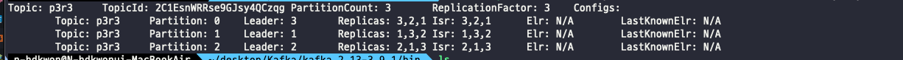

1. 토픽 생성
```bash
kafka-topics.sh --bootstrap-server localhost:9092 --create --topic p3r3 --partitions 3 --replication-factor 3
```

2. 토픽 확인
```shell
kafka-topics.sh --bootstrap-server localhost:9092 --describe --topic p3r3
```

